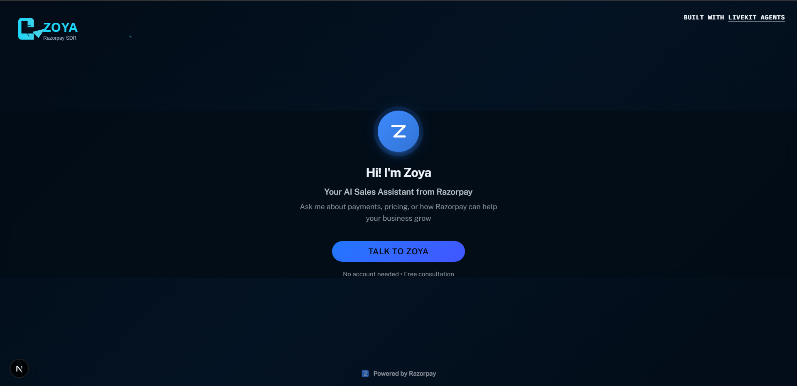

# AI Voice Agents Challenge - Starter Repository

Welcome to the **AI Voice Agents Challenge** by [murf.ai](https://murf.ai)!

## About the Challenge

We just launched **Murf Falcon** – the consistently fastest TTS API, and you're going to be among the first to test it out in ways never thought before!

**Build 10 AI Voice Agents over the course of 10 Days** along with help from our devs and the community champs, and win rewards!
---
---

# Day 5 - Razorpay SDR Agent Implementation

## 🎯 Overview

**Zoya** - An energetic and efficient AI SDR (Sales Development Representative) for Razorpay, India's leading payment solutions company.

### 🖥️ Landing Page



*Modern, Razorpay-themed UI with real-time voice chat capabilities*

## ✨ Features Implemented

### Primary Goal (MVP) ✅

1. **Professional SDR Persona - "Zoya"**
   - Energetic, efficient, and quick-witted
   - Modern fintech vibe matching Razorpay's brand
   - Natural conversational flow

2. **Comprehensive FAQ System**
   - 30+ detailed FAQ entries covering:
     - Product features (Payment Gateway, Subscriptions, Invoices, RazorpayX, etc.)
     - Pricing and transparency
     - Integration details
     - Payment methods (100+ supported)
     - Security and compliance
     - Use cases across industries
     - Technical specifications

3. **Intelligent FAQ Search**
   - Keyword-based matching with scoring algorithm
   - Multi-factor relevance (keywords, question match, category bonus)
   - Natural response formatting

4. **Lead Information Collection**
   - Personal Info: name, email, company, role
   - Business Context: use_case, team_size, timeline, pain_points
   - Automatic tracking of questions asked
   - Interest level qualification

5. **End-of-Call Summary**
   - Personalized closing based on conversation
   - Timeline-aware follow-up promises
   - Automatic interest level scoring
   - Complete lead data export to JSON

## 🛠️ Tools Available to Zoya

### 1. `search_faq(query: str)`
Search Razorpay FAQ for relevant information.
- **When to use**: User asks about products, pricing, features, integrations, etc.
- **Example**: `search_faq("What are your pricing plans?")`

### 2. `save_lead_info(field: str, value: str)`
Save collected lead information incrementally.
- **Fields**: name, email, company, role, use_case, team_size, timeline, pain_point
- **Auto-saves**: Immediately writes to JSON after each field
- **Example**: `save_lead_info("email", "founder@startup.com")`

### 3. `get_pricing_info()`
Get concise Razorpay pricing summary.
- **Returns**: Standard pricing (2% per transaction, zero setup fees)

### 4. `get_company_info()`
Get Razorpay company overview.
- **Returns**: Tagline, description, customer count, industries served

### 5. `end_conversation_summary()`
Generate personalized end-of-call summary.
- **When to use**: User says goodbye, thanks, that's all, etc.
- **Actions**:
  - Creates personalized closing message
  - Scores interest level (high/medium/low)
  - Saves final lead report
  - Provides timeline-aware follow-up promise
---
## Quick Start

### Prerequisites

Make sure you have the following installed:

- Python 3.9+ with [uv](https://docs.astral.sh/uv/) package manager
- Node.js 18+ with pnpm
- [LiveKit CLI](https://docs.livekit.io/home/cli/cli-setup) (optional but recommended)
- [LiveKit Server](https://docs.livekit.io/home/self-hosting/local/) for local development

### 1. Clone the Repository

```bash
git clone <your-repo-url>
cd falcon-tdova-nov25-livekit
```

### 2. Backend Setup

```bash
cd backend

# Install dependencies
uv sync

# Copy environment file and configure
cp .env.example .env.local

# Edit .env.local with your credentials:
# - LIVEKIT_URL
# - LIVEKIT_API_KEY
# - LIVEKIT_API_SECRET
# - MURF_API_KEY (for Falcon TTS)
# - GOOGLE_API_KEY (for Gemini LLM)
# - DEEPGRAM_API_KEY (for Deepgram STT)

# Download required models
uv run python src/agent.py download-files
```

For LiveKit Cloud users, you can automatically populate credentials:

```bash
lk cloud auth
lk app env -w -d .env.local
```

### 3. Frontend Setup

```bash
cd frontend

# Install dependencies
pnpm install

# Copy environment file and configure
cp .env.example .env.local

# Edit .env.local with the same LiveKit credentials
```

### 4. Run the Application

#### Install livekit server

```bash
brew install livekit
```

You have two options:

#### Option A: Use the convenience script (runs everything)

```bash
# From the root directory
chmod +x start_app.sh
./start_app.sh
```

This will start:

- LiveKit Server (in dev mode)
- Backend agent (listening for connections)
- Frontend app (at http://localhost:3000)

#### Option B: Run services individually

```bash
# Terminal 1 - LiveKit Server
livekit-server --dev

# Terminal 2 - Backend Agent
cd backend
uv run python src/agent.py dev

# Terminal 3 - Frontend
cd frontend
pnpm dev
```

Then open http://localhost:3000 in your browser!

## Daily Challenge Tasks

Each day, you'll receive a new task that builds upon your voice agent. The tasks will help you:

- Implement different personas and conversation styles
- Add custom tools and capabilities
- Integrate with external APIs
- Build domain-specific agents (customer service, tutoring, etc.)
- Optimize performance and user experience

**Stay tuned for daily task announcements!**

## Documentation & Resources

- [Murf Falcon TTS Documentation](https://murf.ai/api/docs/text-to-speech/streaming)
- [LiveKit Agents Documentation](https://docs.livekit.io/agents)
- [Original Backend Template](https://github.com/livekit-examples/agent-starter-python)
- [Original Frontend Template](https://github.com/livekit-examples/agent-starter-react)

## Testing

The backend includes a comprehensive test suite:

```bash
cd backend
uv run pytest
```

Learn more about testing voice agents in the [LiveKit testing documentation](https://docs.livekit.io/agents/build/testing/).

## Contributing & Community

This is a challenge repository, but we encourage collaboration and knowledge sharing!

- Share your solutions and learnings on GitHub
- Post about your progress on LinkedIn
- Join the [LiveKit Community Slack](https://livekit.io/join-slack)
- Connect with other challenge participants

## License

This project is based on MIT-licensed templates from LiveKit and includes integration with Murf Falcon. See individual LICENSE files in backend and frontend directories for details.

## Have Fun!

Remember, the goal is to learn, experiment, and build amazing voice AI agents. Don't hesitate to be creative and push the boundaries of what's possible with Murf Falcon and LiveKit!

Good luck with the challenge!

---

Built for the AI Voice Agents Challenge by murf.ai
