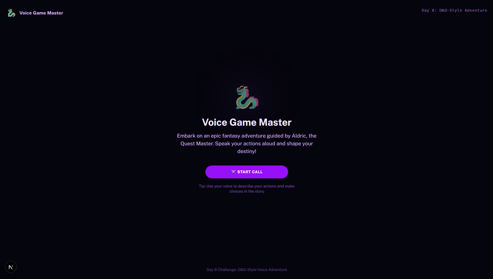

# Day 8 – Voice Game Master (D&D-Style Adventure) 🐉

> Part of the **AI Voice Agents Challenge** by [Murf AI](https://murf.ai)



## 🎮 What I Built

**Meet Aldric** — A wise and dramatic Game Master who guides you through epic fantasy adventures using only your voice!

Speak your actions aloud, and Aldric narrates vivid scenes, presents challenges, and asks "What do you do?" — just like a real D&D session, but powered by AI.

### ✨ Features

- 🐉 **Fantasy Universe** — Medieval world with dragons, magic, ancient ruins, and mysterious creatures
- 🎭 **Dramatic GM Persona** — Aldric the Quest Master with immersive narration style
- 🗣️ **Voice-Driven Gameplay** — Speak your actions, hear the story unfold
- 📜 **Story Continuity** — Remembers player name, choices, NPCs, and past events
- ⚔️ **Interactive Adventures** — 8-15 exchange mini-arcs with discoveries and encounters
- 💬 **Real-time Chat** — GM/Player labels with themed message bubbles

### 🎲 How It Works

| Step | What Happens |
|------|--------------|
| 1️⃣ | Aldric greets you and asks your character name |
| 2️⃣ | GM describes a vivid opening scene |
| 3️⃣ | You speak your action ("I draw my sword...") |
| 4️⃣ | GM narrates the outcome and asks "What do you do?" |
| 5️⃣ | Adventure continues with choices and consequences |

---

## 🛠️ Tech Stack

| Component | Technology |
|-----------|------------|
| 🎙️ TTS | Murf Falcon (en-UK-finley, Narration style) |
| 👂 STT | Deepgram Nova-3 |
| 🧠 LLM | Google Gemini 2.5 Flash |
| 🔊 Voice Pipeline | LiveKit Agents |
| ⚛️ Frontend | Next.js + Tailwind CSS |

---

## 📁 Project Structure

```
├── backend/
│   └── src/
│       └── agent.py              # GameMasterAgent with fantasy prompt
├── frontend/
│   ├── components/
│   │   ├── app/
│   │   │   ├── welcome-view.tsx      # Dragon icon, purple theme
│   │   │   ├── session-view.tsx      # Auto-open chat, auto-scroll
│   │   │   └── chat-transcript.tsx   # Real-time message display
│   │   └── livekit/
│   │       └── chat-entry.tsx        # GM/Player labels & styling
│   ├── app/(app)/
│   │   └── layout.tsx                # Quest Master header
│   └── styles/
│       └── globals.css               # Purple/violet fantasy theme
├── assets/
│   └── gm-landing-page.png           # Landing page screenshot
└── challenges/
    └── Day 8 Task.md
```

---

## 🚀 Quick Start

### 1. Backend Setup

```bash
cd backend

# Start the Game Master agent
uv run python src/agent.py dev
```

### 2. Frontend Setup

```bash
cd frontend
pnpm install
pnpm dev
```

### 3. Start Your Adventure

Open http://localhost:3000 and click **"⚔️ Begin Your Quest"**!

---

## 🧪 Test Scenarios

| Say This | What Happens |
|----------|--------------|
| "My name is Kira" | GM remembers your character name |
| "I look around the room" | GM describes the environment |
| "I approach the dragon carefully" | GM narrates the encounter |
| "I draw my sword and attack" | GM describes combat outcome |
| "I search for treasure" | GM reveals discoveries |
| "Start a new adventure" | Resets the story |

---

## 💬 Sample Conversation

```
Aldric: "Greetings, brave traveler! I am Aldric, the Quest Master. 
        Welcome to the realm of endless adventure. 
        Tell me, what name shall I call you?"

You: "Call me Theron"

Aldric: "Welcome, Theron! You stand at the entrance of an ancient 
        stone tower, shrouded in mist. Torchlight flickers from 
        within, and you hear distant whispers. What do you do?"

You: "I cautiously enter the tower"

Aldric: "You push open the heavy oak door. Inside, a spiral staircase 
        leads upward into darkness. On a nearby table, you spot an 
        old map and a glowing amulet. What do you do?"
```

---

## 🔧 Function Tools

| Tool | Purpose |
|------|---------|
| `start_new_adventure()` | Reset and begin a fresh quest |
| `set_player_name(name)` | Remember the player's character name |

---

## 🎨 Theme

The UI features a **purple/violet fantasy theme**:
- 🐉 Dragon icon branding
- 💜 Purple message bubbles for Quest Master
- 💙 Blue message bubbles for Player
- ⚔️ "Begin Your Quest" call-to-action
- 🌙 Dark fantasy aesthetic

---

## 📚 Resources

- [LiveKit Agents - Prompting](https://docs.livekit.io/agents/build/prompting/)
- [LiveKit Agents - Tools](https://docs.livekit.io/agents/build/tools/)
- [Murf Falcon TTS](https://murf.ai/api/docs/text-to-speech/streaming)

---

## 🏆 Challenge Progress

- [x] Day 1-7: Previous challenges
- [x] **Day 8: Voice Game Master (D&D-Style Adventure)** ← I am here!
- [ ] Day 9-10: Coming soon...

---

Built for the **Murf AI Voice Agents Challenge** 🐉

#MurfAIVoiceAgentsChallenge #10DaysofAIVoiceAgents
