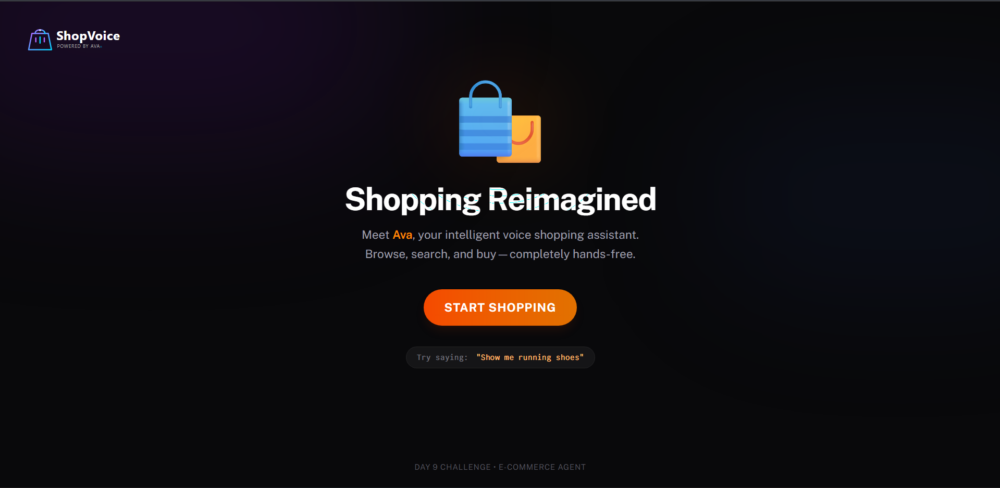

# AI Voice Agents Challenge - Starter Repository

Welcome to the **AI Voice Agents Challenge** by [murf.ai](https://murf.ai)!


# Day 9 – E-commerce Agent (Ava) 🛒

> Part of the **AI Voice Agents Challenge** by [Murf AI](https://murf.ai)

<picture>
      
</picture>

## 🛍️ What I Built

**ShopVoice** — a voice-driven shopping assistant (Ava) that follows a lightweight Agentic Commerce Protocol (ACP) pattern:

- Browse product catalogs by voice
- Request details about items ("Tell me about number 2")
- Place simple orders (persisted to a JSON file)
- View the last order / receive an on-screen receipt

### ✨ Features

- 🧑‍💼 **Agent persona:** Ava — friendly shopping assistant using Murf Falcon TTS
- 🛒 **Catalog:** DummyJSON API integration (images, prices, categories)
- 🧾 **Orders:** ACP-like `line_items` order objects persisted to `backend/src/commerce/orders.json`
- 🔁 **Realtime UI:** Product grid + order receipt streamed from backend via LiveKit text streams

---
# day 9 architecture
```
┌─────────────────────────────────────────────────────────────────────────┐
│                        FRONTEND (Next.js)                                │
│  ┌──────────────┐  ┌──────────────────┐  ┌────────────────────────────┐ │
│  │ Product Grid │  │ Chat Transcript  │  │ Order Receipt              │ │
│  │ (with images)│  │ (real-time)      │  │ (shows on order complete)  │ │
│  └──────┬───────┘  └────────┬─────────┘  └──────────────┬─────────────┘ │
│         │                   │                           │               │
│         │    useTextStream  │    useChatMessages        │  useOrderState│
│         │    (products)     │                           │               │
└─────────┼───────────────────┼───────────────────────────┼───────────────┘
          │                   │                           │
          ▼                   ▼                           ▼
┌─────────────────────────────────────────────────────────────────────────┐
│                         BACKEND (Python Agent)                           │
│                                                                          │
│  ┌─────────────────────────────────────────────────────────────────────┐│
│  │                     EcommerceAgent (Ava)                            ││
│  │  ┌─────────────┐ ┌─────────────┐ ┌─────────────┐ ┌───────────────┐  ││
│  │  │list_products│ │search_prods │ │create_order │ │get_last_order │  ││
│  │  └──────┬──────┘ └──────┬──────┘ └──────┬──────┘ └───────┬───────┘  ││
│  └─────────┼───────────────┼───────────────┼────────────────┼──────────┘│
│            │               │               │                │           │
└────────────┼───────────────┼───────────────┼────────────────┼───────────┘
             │               │               │                │
             ▼               ▼               ▼                ▼
      ┌──────────────────────────┐    ┌──────────────────────────┐
      │     DummyJSON API        │    │    Local orders.json     │
      │  - 190+ products           │    │    - Order persistence   │
      │  - 20+ categories          │    │    - ACP-style schema    │
      │  - Images, ratings       │    │                          │
      └──────────────────────────┘    └──────────────────────────┘
```
---

## 🛠️ Tech Stack

| Component | Technology |
|-----------|------------|
| 🎙️ TTS | Murf Falcon (Murf API) |
| 👂 STT | Deepgram Nova-3 |
| 🧠 LLM | Google Gemini |
| 🔊 Voice Pipeline | LiveKit Agents |
| ⚛️ Frontend | Next.js + Tailwind CSS |

---

## 📁 Project Structure (Day 9 highlights)

```
├── backend/
│   └── src/
│       └── commerce/
│           ├── catalog.py        # dummyjson API helpers
│           ├── orders.py         # Order creation + persistence
│       └── agent.py              # EcommerceAgent (Ava) with function tools
├── frontend/
│   ├── hooks/
│   │   └── useShopData.ts        # LiveKit text-stream listener
│   └── components/
│       └── app/
│           ├── product-grid.tsx
│           └── order-receipt.tsx
└── challenges/
            └── Day 9 Task.md
```

---

## 🚀 Quick Start (run Day 9 locally)

1. Start LiveKit Server (dev mode):

```powershell
livekit-server --dev
```

2. Run the backend agent (from `backend`):

```powershell
cd backend
# ensure virtualenv and deps are installed
uv run python src/agent.py dev
```

3. Run the frontend (from `frontend`):

```powershell
cd frontend
pnpm dev
```

4. Open `http://localhost:3000` and join a session. Try voice commands like:

- "Show me electronics."
- "Tell me about number 2."
- "Buy the first one, my name is John."

---

## 🧭 Where to look in the code

- Backend commerce module: `backend/src/commerce/catalog.py`, `backend/src/commerce/orders.py`
- Agent tools: `backend/src/agent.py`
- Frontend hook: `frontend/hooks/useShopData.ts`
- UI: `frontend/components/app/product-grid.tsx`, `frontend/components/app/order-receipt.tsx`

---

## 🛠️ Notes & Troubleshooting

- Duplicate text-stream handler errors in development: ensure the handler is unregistered in the `useShopData` cleanup (React Strict Mode runs effects twice).
- STT/TTS connection errors usually indicate missing or invalid API keys (`DEEPGRAM_API_KEY`, `MURF_API_KEY`, `GOOGLE_API_KEY`) in `.env.local`.

More details and the task description: `challenges/Day 9 Task.md`


## Documentation & Resources

- [Murf Falcon TTS Documentation](https://murf.ai/api/docs/text-to-speech/streaming)
- [LiveKit Agents Documentation](https://docs.livekit.io/agents)
- [Original Backend Template](https://github.com/livekit-examples/agent-starter-python)
- [Original Frontend Template](https://github.com/livekit-examples/agent-starter-react)

## Testing

The backend includes a comprehensive test suite:

```bash
cd backend
uv run pytest
```

Learn more about testing voice agents in the [LiveKit testing documentation](https://docs.livekit.io/agents/build/testing/).

## Contributing & Community

This is a challenge repository, but we encourage collaboration and knowledge sharing!

- Share your solutions and learnings on GitHub
- Post about your progress on LinkedIn
- Join the [LiveKit Community Slack](https://livekit.io/join-slack)
- Connect with other challenge participants

## License

This project is based on MIT-licensed templates from LiveKit and includes integration with Murf Falcon. See individual LICENSE files in backend and frontend directories for details.

## Have Fun!

Remember, the goal is to learn, experiment, and build amazing voice AI agents. Don't hesitate to be creative and push the boundaries of what's possible with Murf Falcon and LiveKit!

Good luck with the challenge!

---

Built for the AI Voice Agents Challenge by murf.ai
