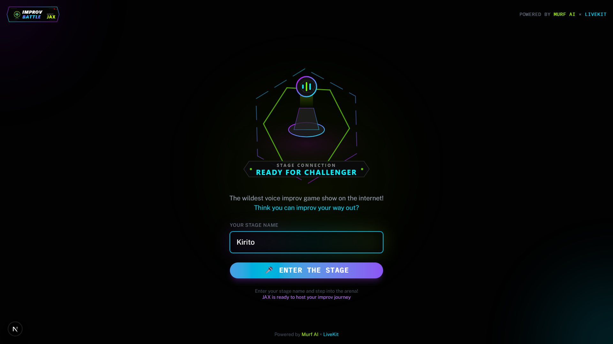
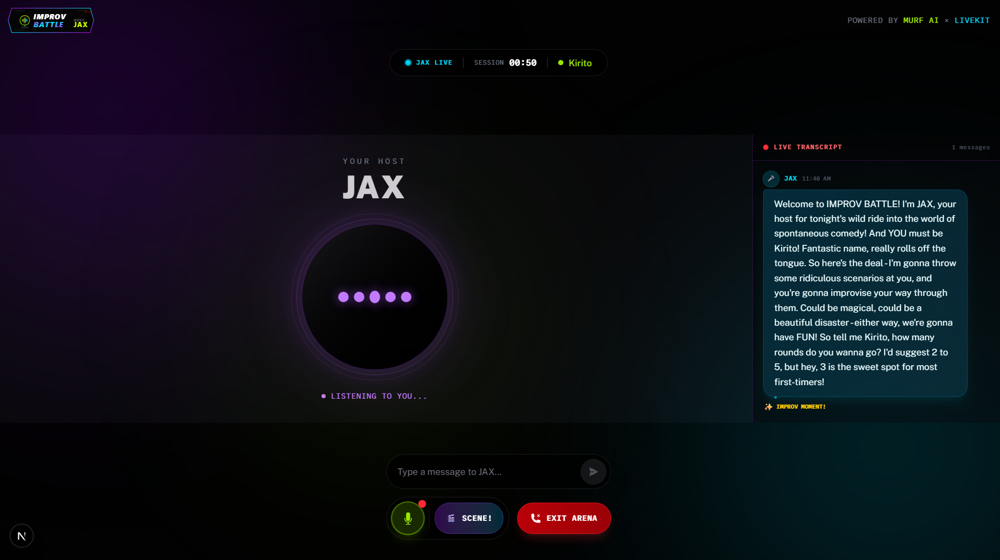

# Day 10 – Voice Improv Battle (JAX) 🎤🎭

> Part of the **AI Voice Agents Challenge** by [Murf AI](https://murf.ai)

<picture>
  
</picture>

## 🎬 What I Built

**IMPROV BATTLE** — the wildest voice-first improv game show on the internet, hosted by **JAX**, an AI game show host with sharp wit and unpredictable energy!

- Voice-first improv game show experience
- AI host that initiates conversation and guides the game
- 15 hilarious improv scenarios to improvise through
- Dynamic feedback system with varied reactions
- Cyberpunk game show themed UI

### ✨ Features

- 🎤 **Agent persona:** JAX — high-energy, witty game show host using Murf Falcon TTS (Terrell voice)
- 🎭 **15 Improv Scenarios:** From "Time-Travel Tech Support" to "Villain TED Talk"
- 🎮 **Game State Management:** Function tools for `start_game`, `present_scenario`, `react_to_performance`, `end_game`, `early_exit`
- 🔊 **Agent-First Initiation:** JAX greets players automatically when they enter the arena
- 💜 **Cyberpunk UI:** Neon purple/cyan/lime themed interface with animated visualizers

<picture>
  
</picture>

---

## 🎪 Game Flow

```
┌─────────────────────────────────────────────────────────────────────────────┐
│                           IMPROV BATTLE GAME FLOW                           │
├─────────────────────────────────────────────────────────────────────────────┤
│                                                                             │
│   ┌─────────────┐      ┌─────────────┐      ┌─────────────────────────┐     │
│   │   WELCOME   │ ──▶  │   PLAYER    │ ──▶ │    ENTER ARENA          │     │
│   │   SCREEN    │      │  NAME INPUT │      │  (JAX greets player)    │     │
│   └─────────────┘      └─────────────┘      └───────────┬─────────────┘     │
│                                                         │                   │
│                                                         ▼                   │
│   ┌─────────────────────────────────────────────────────────────────────┐  │
│   │                        GAME LOOP (2-5 rounds)                       │  │
│   │  ┌──────────┐    ┌──────────────┐    ┌──────────┐    ┌──────────┐  │  │
│   │  │ SCENARIO │ ▶  │   PLAYER     │ ▶  │   JAX    │ ▶  │  NEXT    │  │  │
│   │  │ PRESENT  │    │  IMPROVISES  │    │ REACTS   │    │  ROUND   │  │  │
│   │  └──────────┘    └──────────────┘    └──────────┘    └──────────┘  │  │
│   └─────────────────────────────────────────────────────────────────────┘  │
│                                                         │                   │
│                                                         ▼                   │
│                              ┌─────────────────────────────────────┐        │
│                              │        DRAMATIC CLOSING             │        │
│                              │  - Performance summary              │        │
│                              │  - Memorable moments                │        │
│                              │  - Player improv style              │        │
│                              └─────────────────────────────────────┘        │
└─────────────────────────────────────────────────────────────────────────────┘
```

---

## 🛠️ Tech Stack

| Component | Technology |
|-----------|------------|
| 🎙️ TTS | Murf Falcon (en-US-terrell voice) |
| 👂 STT | Deepgram Nova-3 |
| 🧠 LLM | Google Gemini 2.5 Flash |
| 🔈 Voice Pipeline | LiveKit Agents |
| ⚛️ Frontend | Next.js 15 + Tailwind CSS 4 |
| 🎨 Animations | Motion (Framer Motion) |

---

## 📁 Project Structure (Day 10 highlights)

```
├── backend/
│   └── src/
│       └── agent.py              # ImprovBattleHost (JAX) with game state & function tools
├── frontend/
│   ├── components/
│   │   └── app/
│   │       ├── welcome-view.tsx      # Player name input + animated stage logo
│   │       ├── session-view.tsx      # Split layout (visualizer + transcript)
│   │       ├── improv-visualizer.tsx # Enhanced audio visualizer with speaker detection
│   │       ├── improv-transcript.tsx # Color-coded game show transcript
│   │       └── improv-control-bar.tsx # Chat input + mic toggle + game controls
│   ├── styles/
│   │   └── globals.css           # Cyberpunk theme CSS variables
│   └── public/
│       ├── day10-jax.svg         # Main logo
│       └── day10-jax-center.svg  # Animated stage logo
├── assets/
│   ├── day10-jax-landing-page.png
│   └── day10-jax-arena.png
└── challenges/
    └── Day 10 Task.md
```

---

## 🎭 Improv Scenarios (Sample)

| # | Title | Character |
|---|-------|-----------|
| 1 | Time-Travel Tech Support | Tech support explaining TikTok to Benjamin Franklin |
| 2 | Escaped Dinner | Waiter informing customer their lobster escaped |
| 3 | Alien Job Interview | Alien from Planet Zorblax applying to be a barista |
| 4 | Superhero HR Meeting | HR manager reviewing an underperforming superhero |
| 5 | Villain TED Talk | Supervillain giving work-life balance tips |
| ... | +10 more scenarios | Various hilarious situations |

---

## 🚀 Quick Start (run Day 10 locally)

1. Start LiveKit Server (dev mode):

```powershell
livekit-server --dev
```

2. Run the backend agent (from `backend`):

```powershell
cd backend
uv run python src/agent.py dev
```

3. Run the frontend (from `frontend`):

```powershell
cd frontend
pnpm dev
```

4. Open `http://localhost:3000`:
   - Enter your stage name
   - Click "Enter the Arena"
   - JAX will greet you and start the game automatically!
   - Try improv commands like "let's do 3 rounds" or just go with the flow

---

## 🧭 Where to look in the code

| What | Where |
|------|-------|
| JAX Agent & Game Logic | `backend/src/agent.py` |
| Welcome Page | `frontend/components/app/welcome-view.tsx` |
| Session View (main UI) | `frontend/components/app/session-view.tsx` |
| Audio Visualizer | `frontend/components/app/improv-visualizer.tsx` |
| Chat Transcript | `frontend/components/app/improv-transcript.tsx` |
| Control Bar | `frontend/components/app/improv-control-bar.tsx` |
| Cyberpunk Theme | `frontend/styles/globals.css` |

---

## 🎨 Theme Colors

| Color | Hex | Usage |
|-------|-----|-------|
| 💜 Purple | `#cc00ff` | Primary accent, JAX branding |
| 💙 Cyan | `#00eaff` | JAX speaking indicator |
| 💚 Lime | `#ccff00` | Player speaking, mic active |

---

## 🛠️ Notes & Troubleshooting

- **Agent doesn't speak first?** Make sure the backend agent was restarted after the latest changes. The greeting is triggered in `session.generate_reply()` after connection.
- **TypeScript module errors?** Try restarting the TypeScript server in VS Code (`Ctrl+Shift+P` → "TypeScript: Restart TS Server")
- **STT/TTS connection errors?** Check your API keys in `.env.local` (`DEEPGRAM_API_KEY`, `MURF_API_KEY`, `GOOGLE_API_KEY`)

More details and the task description: `challenges/Day 10 Task.md`

---

## Documentation & Resources

- [Murf Falcon TTS Documentation](https://murf.ai/api/docs/text-to-speech/streaming)
- [LiveKit Agents Documentation](https://docs.livekit.io/agents)
- [Original Backend Template](https://github.com/livekit-examples/agent-starter-python)
- [Original Frontend Template](https://github.com/livekit-examples/agent-starter-react)

## Testing

The backend includes a comprehensive test suite:

```bash
cd backend
uv run pytest
```

Learn more about testing voice agents in the [LiveKit testing documentation](https://docs.livekit.io/agents/build/testing/).

## Contributing & Community

This is a challenge repository, but we encourage collaboration and knowledge sharing!

- Share your solutions and learnings on GitHub
- Post about your progress on LinkedIn
- Join the [LiveKit Community Slack](https://livekit.io/join-slack)
- Connect with other challenge participants

## License

This project is based on MIT-licensed templates from LiveKit and includes integration with Murf Falcon. See individual LICENSE files in backend and frontend directories for details.

## 🎉 Challenge Complete!

**Day 10 marks the final day of the 10 Days of Voice Agents Challenge!**

Thanks for following along this journey of building increasingly creative voice agents. From simple conversational agents to game show hosts - it's been a wild ride!

---

Built for the AI Voice Agents Challenge by murf.ai 🎤
