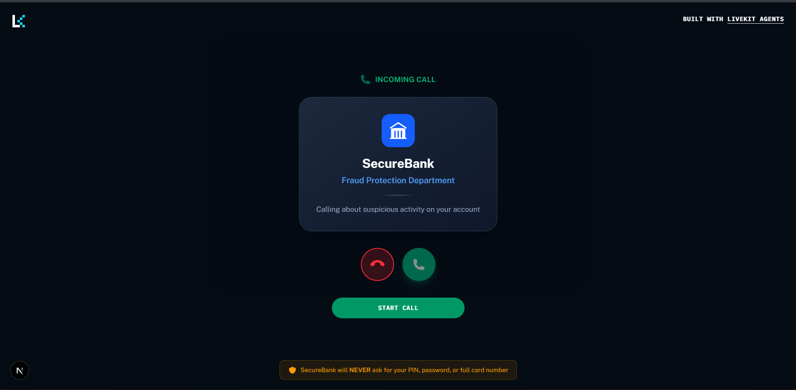

# Day 6 – Fraud Alert Voice Agent 🏦

> Part of the **AI Voice Agents Challenge** by [Murf AI](https://murf.ai)



## 🎯 What I Built

**Meet Alex** — A Fraud Alert Voice Agent for SecureBank that simulates real bank fraud detection calls!

Alex initiates outbound calls to customers about suspicious transactions, verifies their identity, and updates the fraud case status in real-time.

### ✨ Features

- 📞 **Incoming Call UI** — Realistic "Answer/Decline" call interface
- 🔐 **Identity Verification** — Security questions before revealing details
- 💳 **Transaction Details** — Reads merchant, amount, location, time
- 🗄️ **SQLite Database** — Persists fraud cases with real-time updates
- 🎙️ **Real-time Chat** — Auto-opens transcript when agent speaks

### 📊 Three Scenarios Handled

| Scenario | Status | Description |
|----------|--------|-------------|
| ✅ Confirmed Safe | `confirmed_safe` | Customer made the transaction |
| 🚨 Confirmed Fraud | `confirmed_fraud` | Card blocked, dispute raised |
| ❌ Verification Failed | `verification_failed` | Wrong security answer, call ended |

---

## 🛠️ Tech Stack

| Component | Technology |
|-----------|------------|
| 🎙️ TTS | Murf Falcon (fastest TTS API!) |
| 👂 STT | Deepgram Nova-3 |
| 🧠 LLM | Google Gemini 2.5 Flash |
| 🗄️ Database | SQLite |
| 🔧 Voice Pipeline | LiveKit Agents |
| ⚛️ Frontend | Next.js + Tailwind CSS |

---

## 📁 Project Structure

```
├── backend/
│   └── src/
│       ├── agent.py              # FraudAlertAgent with 4 function tools
│       ├── fraud_cases.db        # SQLite database
│       └── database/
│           ├── __init__.py
│           ├── fraud_db.py       # Database operations
│           ├── seed_data.py      # Sample fraud cases
│           └── view_cases.py     # CLI viewer for cases
├── frontend/
│   ├── components/app/
│   │   ├── welcome-view.tsx      # "Incoming Call" UI
│   │   ├── session-view.tsx      # Auto-open chat
│   │   ├── tile-layout.tsx       # Blue-themed visualizer
│   │   └── chat-transcript.tsx   # Simplified real-time chat
│   ├── hooks/
│   │   └── useChatMessages.ts    # Real-time transcription fix
│   └── styles/
│       └── globals.css           # Bank-themed colors
└── challenges/
    └── Day 6 Task.md
```

---

## 🚀 Quick Start

### 1. Backend Setup

```bash
cd backend

# Seed the database with sample fraud cases
uv run python -m src.database.seed_data

# Start the agent
uv run python src/agent.py dev
```

### 2. Frontend Setup

```bash
cd frontend
pnpm install
pnpm dev
```

### 3. View Database Status

```bash
cd backend
uv run python -m src.database.view_cases
```

---

## 🧪 Test Scenarios

| Customer | Security Question | Answer | Try Saying |
|----------|-------------------|--------|------------|
| John | Mother's maiden name? | Smith | "Yes" → Safe |
| Sarah | First pet's name? | Buddy | "No" → Fraud |
| Mike | Favorite movie? | Inception | Wrong answer → Failed |

---

## 📞 Call Flow

```
1. Agent: "Hello, this is Alex from SecureBank..."
2. User: Confirms name (e.g., "John")
3. Agent: Loads case, asks security question
4. User: Answers security question
5. Agent: Reads transaction details
6. User: "Yes I made it" or "No I didn't"
7. Agent: Updates database, confirms action taken
```

---

## 🔧 Function Tools

| Tool | Purpose |
|------|---------|
| `load_fraud_case(user_name)` | Fetch pending case from database |
| `verify_customer_identity(user_name, answer)` | Check security answer |
| `mark_transaction_safe(case_id)` | Mark as confirmed safe |
| `mark_transaction_fraudulent(case_id)` | Mark as fraud, block card |

---

## 📚 Resources

- [LiveKit Agents - Tools](https://docs.livekit.io/agents/build/tools/)
- [Python SQLite Guide](https://www.geeksforgeeks.org/python/python-sqlite/)
- [Murf Falcon TTS](https://murf.ai/api/docs/text-to-speech/streaming)

---

## 🏆 Challenge Progress

- [x] Day 1-5: Previous challenges
- [x] **Day 6: Fraud Alert Voice Agent** ← I am here!
- [ ] Day 7-10: Coming soon...

---

Built for the **Murf AI Voice Agents Challenge** 🚀

#MurfAIVoiceAgentsChallenge #10DaysofAIVoiceAgents
