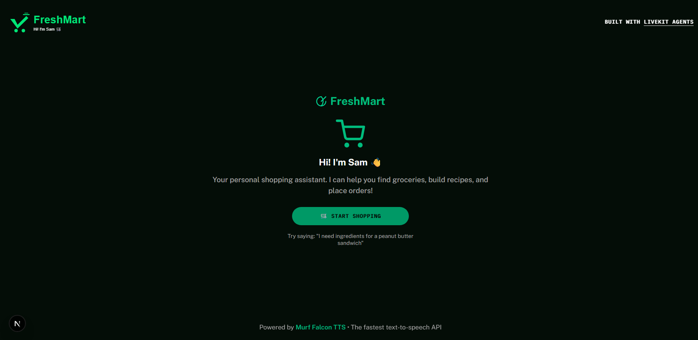

# Day 7 – FreshMart Shopping Voice Agent 🛒

> Part of the **AI Voice Agents Challenge** by [Murf AI](https://murf.ai)



## 🎯 What I Built

**Meet Sam** — A friendly shopping assistant for FreshMart that helps you order groceries, find recipes, and track your deliveries!

Sam can search products, build shopping carts, understand recipe-based requests like "ingredients for a peanut butter sandwich", and track your orders in real-time.

### ✅ Features

- 🛒 **Smart Catalog Search** — 30 items across groceries, snacks, and prepared foods
- 🍳 **Recipe Intelligence** — "I need ingredients for pasta" adds multiple items
- 📦 **Cart Management** — Add, remove, update quantities via voice
- 🚚 **Auto Order Tracking** — Status updates every 5 seconds (simulated delivery)
- 🗄️ **SQLite Database** — Persists orders with real-time status updates
- 💬 **Real-time Chat** — Proper left/right message alignment

### 📋 Order Status Flow

| Status | Description |
|--------|-------------|
| 📥 Received | Order just placed |
| ✅ Confirmed | Order confirmed by store |
| 👨‍🍳 Preparing | Items being packed |
| 🚗 Out for Delivery | Driver on the way |
| 🎉 Delivered | Order complete! |

---

## 🛠️ Tech Stack

| Component | Technology |
|-----------|------------|
| 🎙️ TTS | Murf Falcon (en-US-natalie) |
| 👂 STT | Deepgram Nova-3 |
| 🧠 LLM | Google Gemini 2.5 Flash |
| 🗄️ Database | SQLite |
| 🔊 Voice Pipeline | LiveKit Agents |
| ⚛️ Frontend | Next.js + Tailwind CSS |

---

## 📁 Project Structure

```
├── backend/
│   └── src/
│       ├── agent.py              # FreshMartAgent with 10 function tools
│       └── data/
│           ├── database.py       # SQLite database layer
│           ├── catalog.json      # 30 grocery items
│           ├── recipes.json      # 14 recipe mappings
│           ├── cart_manager.py   # In-memory cart operations
│           ├── order_manager.py  # Orders + auto-delivery simulation
│           ├── freshmart.db      # SQLite database
│           └── view_orders.py    # CLI viewer for orders
├── frontend/
│   ├── components/app/
│   │   ├── welcome-view.tsx      # FreshMart landing page
│   │   ├── session-view.tsx      # Auto-open chat
│   │   ├── tile-layout.tsx       # Green-themed visualizer
│   │   └── chat-transcript.tsx   # Chat display
│   ├── hooks/
│   │   └── useChatMessages.ts    # Real-time transcription
│   └── styles/
│       └── globals.css           # Emerald/green theme
└── challenges/
    └── Day 7 Task.md
```

---

## 🚀 Quick Start

### 1. Backend Setup

```bash
cd backend

# Start the agent (auto-seeds database on first run)
uv run python src/agent.py dev
```

### 2. Frontend Setup

```bash
cd frontend
pnpm install
pnpm dev
```

### 3. View Orders & Catalog

```bash
cd backend
uv run python src/data/view_orders.py
```

---

## 🧪 Test Scenarios

| Say This | What Happens |
|----------|--------------|
| "What snacks do you have?" | Lists chips, cookies, etc. |
| "I need ingredients for a PB&J sandwich" | Adds bread, peanut butter, jelly |
| "Add 2 bottles of milk" | Adds to cart |
| "What's in my cart?" | Lists cart with total |
| "Place my order" | Creates order, starts tracking |
| "Where is my order?" | Returns current status |
| "Cancel my order" | Cancels if not yet delivered |

---

## 📞 Sample Conversation

```
Sam: "Hey there! Welcome to FreshMart! I'm Sam, your shopping assistant..."

You: "I need ingredients for grilled cheese"
Sam: "I've added bread, cheese, and butter to your cart..."

You: "Add a bag of chips too"
Sam: "Added potato chips..."

You: "Place my order"
Sam: "Order FM-12345 placed! Total $8.47. I'll track it for you..."

You: "Where is my order?"
Sam: "Your order is currently being prepared..."
```

---

## 🔧 Function Tools (10 Total)

| Tool | Purpose |
|------|---------|
| `search_catalog(query)` | Find items by name/category |
| `get_recipe_items(recipe_name)` | Get ingredients for a dish |
| `add_to_cart(item_id, quantity)` | Add single item |
| `add_recipe_to_cart(recipe_name)` | Add all recipe ingredients |
| `remove_from_cart(item_id)` | Remove item from cart |
| `update_cart_quantity(item_id, quantity)` | Change quantity |
| `get_cart()` | View current cart |
| `place_order(customer_name)` | Checkout and start tracking |
| `get_order_status(order_id)` | Check delivery status |
| `cancel_order(order_id)` | Cancel if not delivered |

---

## 📚 Resources

- [LiveKit Agents - Tools](https://docs.livekit.io/agents/build/tools/)
- [LiveKit Agents - Prompting](https://docs.livekit.io/agents/build/prompting/)
- [Python SQLite Guide](https://www.geeksforgeeks.org/python/python-sqlite/)
- [Murf Falcon TTS](https://murf.ai/api/docs/text-to-speech/streaming)

---

## 🏅 Challenge Progress

- [x] Day 1-6: Previous challenges
- [x] **Day 7: Food & Grocery Ordering Voice Agent** ← I am here!
- [ ] Day 8-10: Coming soon...

---

Built for the **Murf AI Voice Agents Challenge** 🛒

#MurfAIVoiceAgentsChallenge #10DaysofAIVoiceAgents
